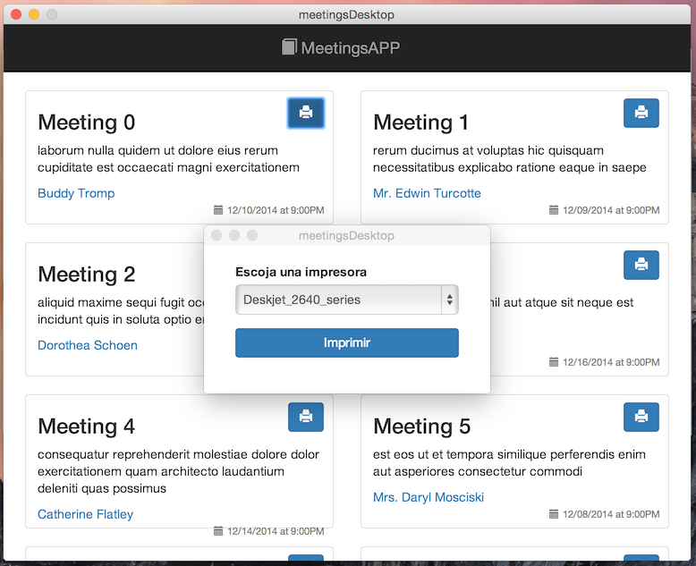

meetings-desktop
================

Node Webkit + Angular + Gulp + Boostrap - Simple desktop application



An application that demonstrates the ability to share javascript code between the browser and native desktop applications.

### prerequisites

* Gulp

```bash
$ npm install -g gulp
```

### environment variables

You need to create a `enviroments/development.json` file and set the variables
defined on `enviroments/development.json.example`

To add a set of variables to other environment, just have to create separate files
with the name of each of the environments.

For example, to create a set of variables for the environment `my_enviroment_name`,
you should create a `my_enviroment_name.json` file inside the enviroments folder.
Then you only have to run `gulp build --env my_enviroment_name` in your terminal,
and voila, all your environment variables were loaded on your app.

To use the variables as constants in the app you need to add `app.config` module as a dependency for your app:

```javascript
angular.module('myApp', ['app.config']);
```

### proxy and pow

In development mode, you can to set the meeting server with pow, so that responds to `http://meeting.pow`

For that just pass the `PROXY_API_URL` environmental variable to gulp.


### the first time and when gulp or bower dependencies changes

```bash
$ npm install -d
$ bower install
```

### all the magic in a single line

The application will be available in http://localhost:9000

```bash
$ gulp build #to run in development mode
$ gulp build --env my_enviroment_name #to build app
```

### distribute the app

```bash
$ gulp build --env production #to build app
$ build-osx # to create an executable for osx
$ build-linux # to create an executable for linux
$ build-win # to create an executable for win
```

### Testing
